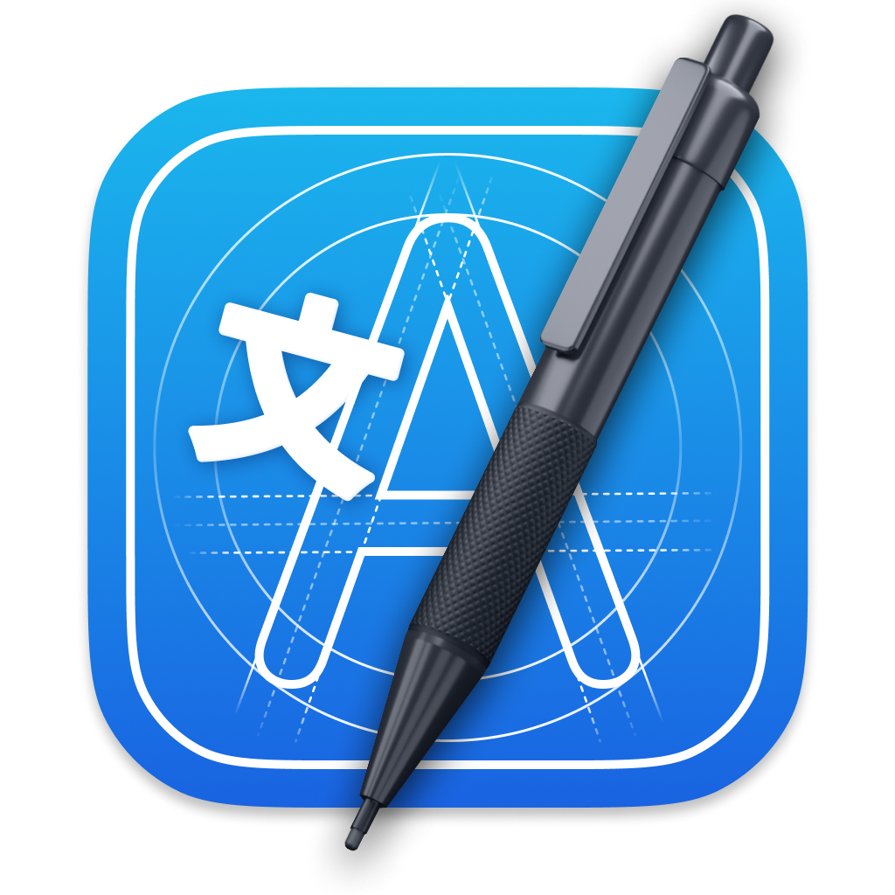
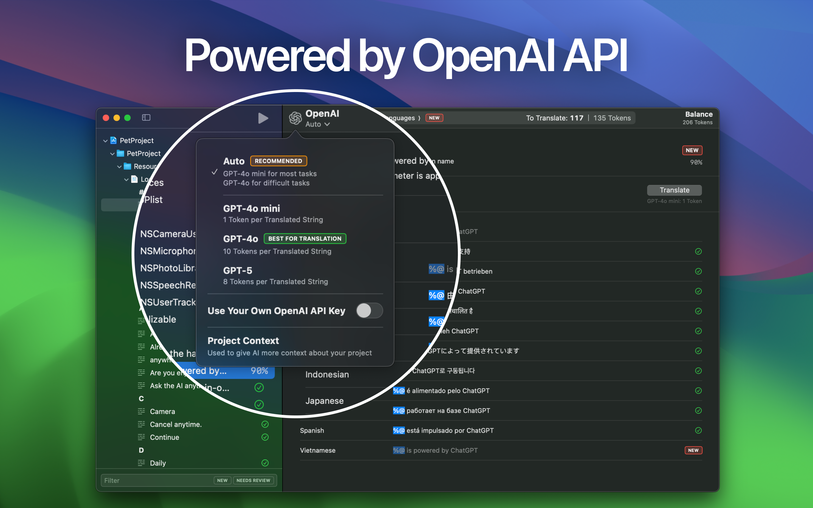
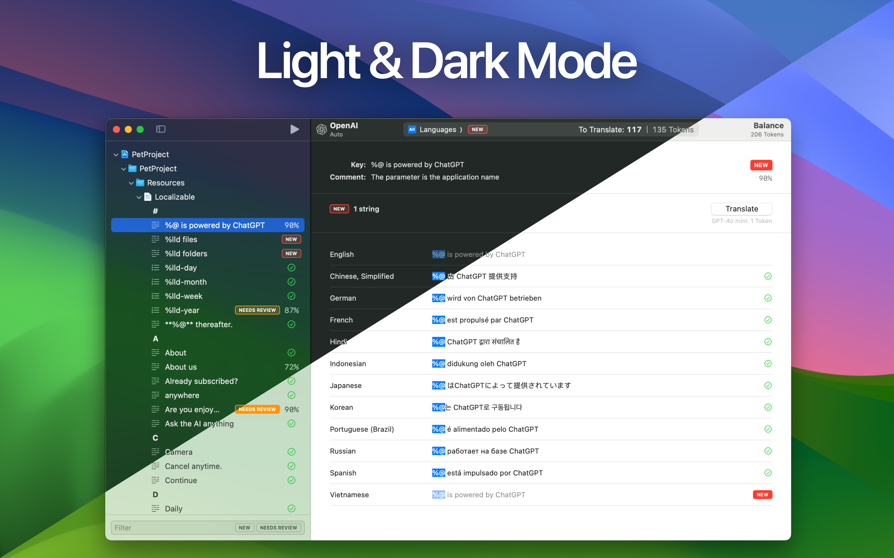

  <h3 align="center">String Catalog – AI Translate</h3>
  <h6 align="center">AI Translation Tool for Xcode</h6>

  

* * *

String Catalog is an AI tool designed for developers looking to efficiently localize their apps without overspending. Powered by OpenAI API, this app allows you to quickly translate your app’s strings into multiple languages, making it perfect for solo developers and small teams. There’s no need for manual imports or exports. String Catalog seamlessly syncs with your Xcode project. Simply select your project with string catalog (.xcstrings) files, and the app will handle the rest.

### AI-Powered Translations

Translate your app’s strings into dozens of languages in minutes, leveraging the power of ChatGPT. Choose from AI models, including GPT-4o mini, GPT-4o, GPT-5, or use Auto mode for convenience.

### Context-Aware Translations

Ensure accurate translations by adding contextual information to string comments. The AI will take these details into account, improving translation quality.

### Preserves Formatting

The AI understands and preserves formatting, such as Markdown or HTML, ensuring that your translated strings maintain their structure and style across different languages.

### Manual String Editing

Review and manually edit translations to maintain full control over your app’s content.

### Supports Complex String Structures

Effortlessly manage complex string catalogs with plural and device variations, ensuring your translations are grammatically correct in every language.

### Flexible Payment Options

String Catalog offers flexibility with two payment models: purchase tokens directly in the app and pay only for the translations you need (no subscription required), or subscribe to String Catalog Advanced to use your own OpenAI API key for greater control and flexibility.

### Perfect for Small Teams and Indie Developers

String Catalog is designed with simplicity and efficiency in mind, making it accessible to developers of any scale.

### User-Friendly Interface

Enjoy a smooth experience with support for both light and dark modes, tailored to your system preferences.

  <a href="https://sergey-rezanov.github.io/string-catalog/support">Support</a>
  
    •
  
  <a href="https://sergey-rezanov.github.io/string-catalog/policy">Privacy Policy</a>

